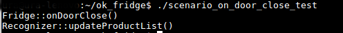
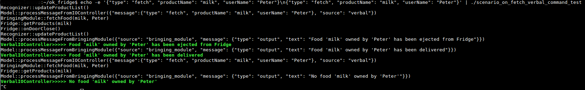

# ok_fridge
### Ok, Fridge project MIPT-PPS-2017

Соответствующая проекту презентация: https://vk.com/away.php?to=https%3A%2F%2Fdocs.google.com%2Fpresentation%2Fd%2F1xUWP3W3amtKXdz-A_NkwIa7erNUEVEstaD8sCzgLJtw%2Fedit%3Fusp%3Dsharing&cc_key=

Док по заданию 2: https://docs.google.com/document/d/1z4hoS70uTGzbNFOboMEDhiYCgdEwAED7b9Gf__JQXD4/edit?usp=sharing

Док по заданию 1: https://docs.google.com/document/d/1dbXBvA_RNuhprjdqfG0Cg3y115vzAk9GGROSI2GmZSs/edit?usp=sharing

## Это прототип

  - Запуск сценария onDoorClose: `ok_fridge$ ./scenario_on_door_close_test`

  

  - Запуск сценария fetchFood: `echo -e '{"type": "fetch", "productName": "milk", "userName": "Peter"}\n{"type": "fetch", "productName": "milk", "userName": "Peter"}' | ./scenario_on_fetch_verbal_command_test`

  В этом случае дается два "голосовых" запроса. Оба раза просится принести молоко. В первый раз запрос выполняется успешно, а во второй нет, так как молока в холодильнике уже нет.

  

